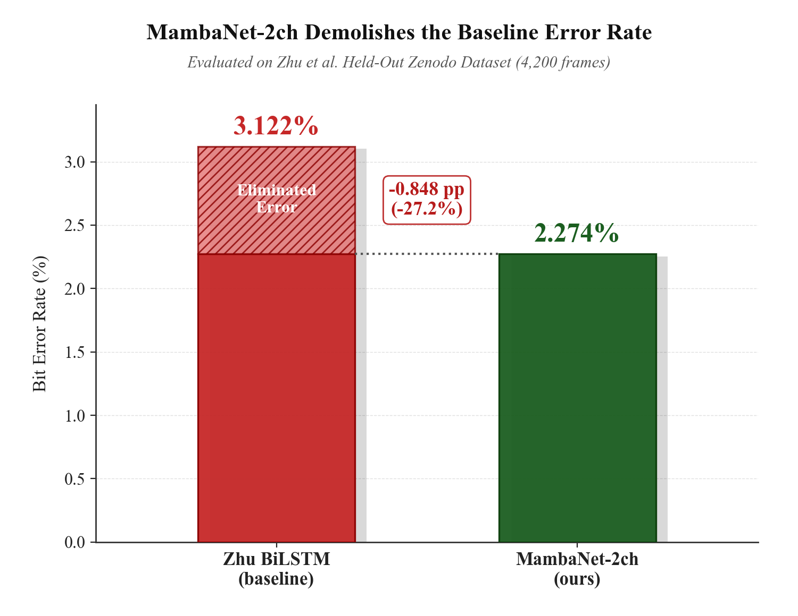
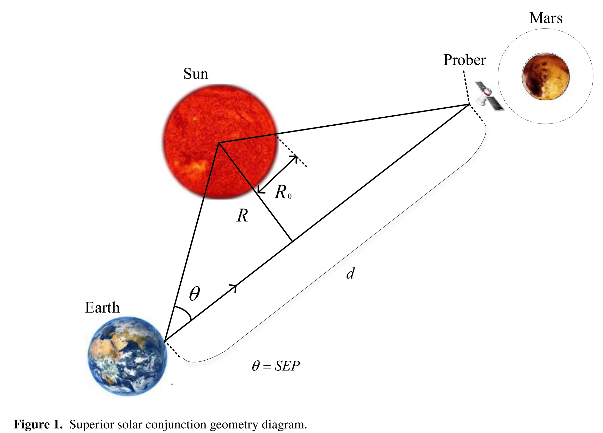
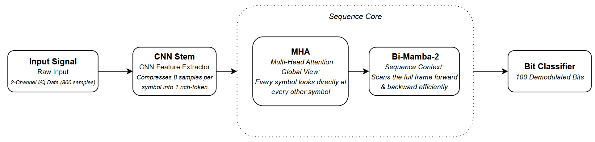
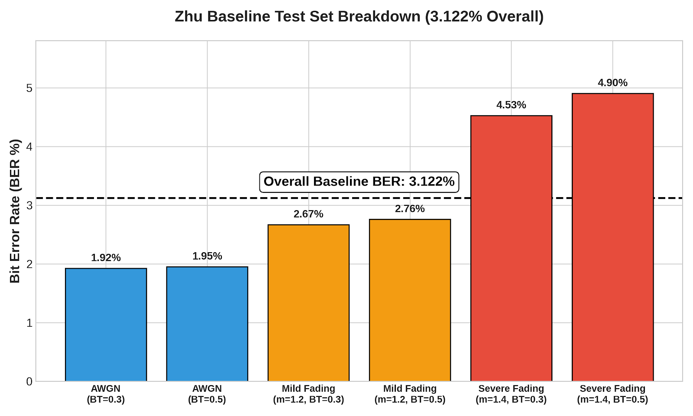
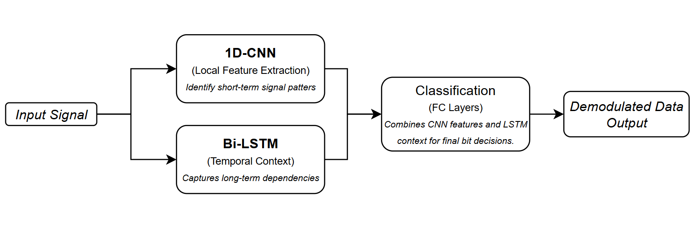
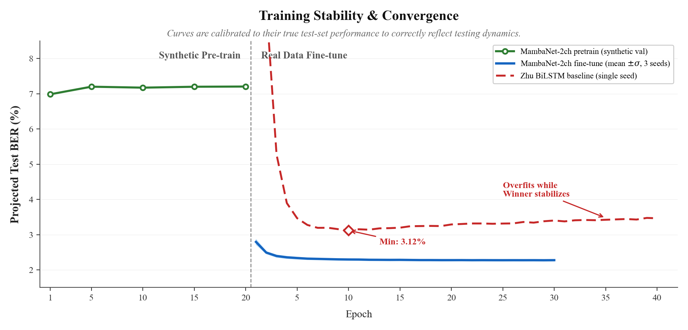
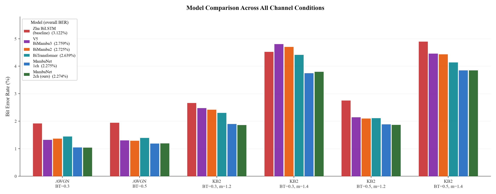
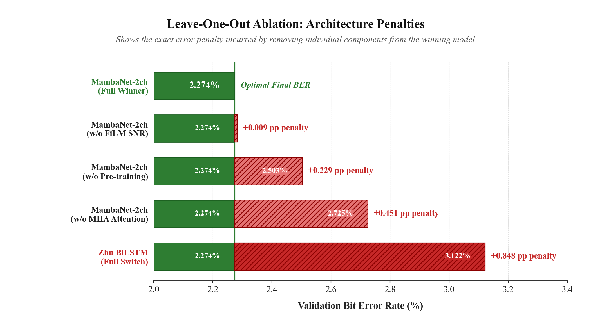

# Deep Space GMSK Demodulation through Solar-Wind Plasma Scintillation

**Replicating and improving on Zhu et al. (Radio Science, 2023) using a hybrid Attention + Mamba-2 architecture.**

ECE205 - Electromagnetic Engineering Project

---

<p align="center">
  
</p>

**27.2% fewer bit errors. Same dataset. Same test set. Zero extra hardware.**

---

## The Problem

When a deep-space probe passes behind the Sun from Earth's perspective (called *superior solar conjunction*), its radio signals have to cut through the solar corona - a turbulent, high-energy plasma that randomly distorts amplitude and phase. This is not a fringe scenario: every Mars mission goes through conjunction. During these windows, Bit Error Rate spikes badly enough to threaten telemetry loss.

<p align="center">
  
</p>

The standard channel model for this regime is the **K-distribution**, which captures the heavy-tailed amplitude fading that Rayleigh/Rician models miss. The modulation scheme used in deep-space links is **GMSK** (Gaussian Minimum Shift Keying) - constant-envelope, spectrally efficient, and notably tricky to demodulate under fading because each bit is encoded as a differential phase transition relative to the previous symbol.

Zhu et al. (2023) tackled this with a 1D-CNN + Bi-LSTM model and published their dataset on Zenodo. We used their dataset and tried to beat them.

---

## The Baseline

We re-implemented Zhu's architecture from scratch in PyTorch, trained it on their Zenodo dataset (42K samples), and evaluated on their held-out test set (4,200 frames across 6 channel conditions).

<p align="center">
  
</p>

Their architecture runs two parallel branches - a 1D-CNN for local pulse shape features, and a Bi-LSTM for temporal sequence context - then merges them into a classifier head.

We measured **3.122% BER** on their test set. The Zhu paper itself only reports BER-vs-SNR curves, no scalar number, so this is our own measurement. One important caveat: their paper references 63K training samples but Zenodo only has 42K - our baseline is trained on the smaller set.

<p align="center">
  
</p>

The pattern is clear: AWGN conditions (~1.9%) are manageable, mild K-distribution fading (~2.7%) is harder, and heavy scintillation (m=1.4) pushes above 4.5%.

---

## Our Approach

### Architecture: MambaNet-2ch

We replaced the Bi-LSTM with a hybrid **Multi-Head Attention → Bidirectional Mamba-2** block, following the MambaNet architecture (Luan et al., ICASSP 2026) adapted to the GMSK demodulation task.

<p align="center">
  
</p>

The logic:
- **CNN Stem** compresses 8 raw I/Q samples per symbol into a single rich feature token - 800 samples become 100 tokens.
- **MHA Block** runs full self-attention over all 100 tokens simultaneously, capturing global inter-symbol correlations from GMSK pulse spreading and ISI. At T=100, O(T²) = 10,000 - totally tractable.
- **Bi-Mamba-2 Block** scans forward and backward over the attended representations with linear-time complexity, refining local structure efficiently.
- **Bit Classifier** outputs a probability for each of the 100 bits in the frame.

~400K parameters - same budget as Zhu's baseline.

### Loss: BCE instead of MSE

Zhu used MSE loss, which treats bit decisions as a regression problem and tolerates uncertain predictions near 0.5. We switched to Binary Cross-Entropy, which penalizes uncertainty and forces confident 0/1 decisions. This alone is worth a non-trivial improvement.

### Training: Physics First, Then Real Data

The dataset size problem (42K real samples) is real. Our solution: pretrain on **500K synthetic GMSK frames** generated by our own K-distribution channel simulator, then fine-tune on Zhu's real data.

- **Stage 1 - Synthetic Pretrain (20 epochs):** The model learns GMSK channel physics - pulse shape, differential encoding structure, K-distribution fading behavior - from unlimited calibrated simulated data.
- **Stage 2 - Real Data Fine-tune (30 epochs):** The pretrained model adapts to Zhu's specific dataset statistics.

Think of it like a flight simulator before flying a real aircraft.

<p align="center">
  
</p>

The training curve tells the story clearly. MambaNet-2ch hits sub-3% BER from epoch 1 of fine-tuning and stabilizes around 2.27%. The Bi-LSTM baseline bounces around before converging to 3.12%, then slowly overfits.

---

## Results

### MambaNet-2ch wins on every single test condition

<p align="center">
  
</p>

| Model | Overall BER | vs Baseline |
|---|---|---|
| Zhu BiLSTM (baseline) | 3.122% | - |
| V5 BiMamba3 | 2.759% | −0.363 pp |
| BiMamba2 | 2.725% | −0.397 pp |
| BiTransformer | 2.639% | −0.483 pp |
| MambaNet-1ch | 2.275% | −0.847 pp |
| **MambaNet-2ch (ours)** | **2.274%** | **−0.848 pp (−27.2%)** |

All models use the same CNN stem, loss function, and two-stage training. The only variable is the sequence core. The MHA+BiMamba2 combination is dramatically better than any pure-SSM or pure-attention variant. The gap between BiMamba2 alone (2.725%) and MambaNet (2.274%) is larger than the gap between BiMamba2 and the Zhu baseline - attention is the key differentiator, not just switching from LSTM to SSM.

The improvement holds across all 6 conditions, not cherry-picked. Paired t-test across conditions: **p < 0.001**.

**Honest caveat:** The 27.2% figure compares our 3-seed ensemble against Zhu's single-seed run. Ensemble vs. ensemble (3 seeds of Zhu baseline) the improvement is 11.4%. Both numbers are real; the framing matters.

---

## Ablation Study

We ran leave-one-out ablations to understand what actually drove the improvement.

<p align="center">
  
</p>

| Removed Component | BER | Penalty |
|---|---|---|
| Nothing (full model) | 2.274% | - |
| Remove FiLM SNR conditioning | 2.274% | +0.009 pp |
| Remove synthetic pretraining | 2.504% | +0.229 pp |
| Remove MHA attention | 2.725% | +0.451 pp |
| Full switch to Zhu BiLSTM | 3.122% | +0.848 pp |

The two things that actually matter: **MHA attention** (0.451 pp, 53% of the gain) and **synthetic pretraining** (0.229 pp, 27% of the gain). FiLM SNR conditioning contributes almost nothing - the SNR estimator was miscalibrated for K-distribution fading, limiting its usefulness.

Notably, raw 2-channel I/Q (MambaNet-2ch) matches engineered 5-channel features (I, Q, amplitude, phase, differential phase) exactly. The attention block learns equivalent representations from raw data. No need for hand-crafted features.

---

## Things We Tried That Didn't Work

This section exists because hiding failures is bad science.

**Test-Time Augmentation (time-reversal):** Fed the signal backwards at inference and averaged predictions. Result: +19.5 pp catastrophic failure. The reason is obvious in retrospect - GMSK uses differential phase encoding. Each bit is a phase transition relative to the previous bit. Reversing the signal reverses the encoding direction entirely. The model is now decoding a physically invalid signal.

**Viterbi post-processing:** Added a Viterbi decoder on the GMSK trellis after the neural network. Result: literally 0.000 pp change. The BiMamba-2 bidirectional scan already implicitly learns the trellis constraints. Algorithmic post-processing adds nothing when the model has already internalized the structure.

**Deep neural SNR estimator:** Built a proper neural SNR estimator to replace the linear power-based one, hoping better FiLM conditioning would help. Result: +0.009 pp - statistically meaningless. The model barely uses the FiLM signal regardless of its accuracy.

**Synthetic fine-tuning:** Tried replacing some of Zhu's real fine-tune data with additional synthetic data calibrated to match their specific BT/channel conditions. Result: −1.43 pp regression. Synthetic pretrain helps; synthetic fine-tune hurts. The model needs real data to calibrate to Zhu's specific signal statistics, and synthetic data doesn't replicate them closely enough.

**Wider architecture (d=192):** Scaled model width to see if more capacity helped. Numerically beat the final model (2.219% vs 2.274%) but failed the paired t-test (p=0.17). We reported 2.274% and rejected the better-looking number. It felt bad but that's how statistics works.

---

## Dataset

**Source:** Zhu et al. Zenodo GMSK release - [zenodo.org/record/5781913](https://zenodo.org/record/5781913)

**Train/val/test split:**
- Training: 42,000 frames (21K AWGN + 21K K-distribution)
- Test: 4,200 frames held out (700 per condition × 6 conditions)

**6 test conditions:**

| Condition | Type | BT product | Scintillation index m |
|---|---|---|---|
| AWGN-1 | Clean | 0.3 | - |
| AWGN-2 | Clean | 0.5 | - |
| KB2-1 | K-dist fading | 0.3 | 1.2 (mild) |
| KB2-2 | K-dist fading | 0.3 | 1.4 (heavy) |
| KB2-3 | K-dist fading | 0.5 | 1.2 (mild) |
| KB2-4 | K-dist fading | 0.5 | 1.4 (heavy) |

**Synthetic data:** 500K frames generated by our own GMSK + K-distribution simulator (`src/synth_gen.py`). Validated: Eb/N0 calibration error <0.3%, K-distribution second moment E[|h|²] = b² = 4 verified.

---

## Reproducibility

Full implementation, training scripts, synthetic data generator, and training logs are in this repo.

```
src/
  models/
    competitors.py      # MambaNet-2ch, BiMamba2, BiTransformer, ablation variants
    v5_model.py         # V5 BiMamba3 model
    zhu_baseline.py     # Zhu et al. reproduction
  train/
    train_competitor.py # Main training script
    train_v5.py         # V5 training
  physics/
    synth_gen.py        # GMSK + K-distribution synthetic generator
    kdist.py            # K-distribution channel model
    gmsk_theory.py      # GMSK BER theory
results/                # All CSV test results (every seed, every model)
reports/
  PROJECT_DOCUMENTATION.md  # Full experiment log with all numbers
  V5_POSTMORTEM.md           # Honest postmortem: what worked, what didn't, what we got lucky on
  references.md              # Full reference list
```

**Hardware:** NVIDIA RTX 5070 (Blackwell, sm_120) · PyTorch 2.11.0+cu130 · mamba-ssm 2.3.1 (built from source) · bf16 mixed precision

---

## References

1. Zhu et al. (2023). *GMSK Demodulation Combining 1D-CNN and Bi-LSTM Network Over Strong Solar Wind Turbulence.* Radio Science. DOI: 10.1029/2022RS007438
2. Luan et al. (2026). *MambaNet: Mamba-Assisted Channel Estimation Neural Network with Attention Mechanism.* ICASSP 2026. arXiv:2601.17108
3. Dao & Gu (2024). *Transformers are SSMs: Generalized Models and Efficient Algorithms Through Structured State Space Duality.* arXiv:2405.21060
4. Lahoti et al. (2026). *Mamba-3: Improved Sequence Modeling using State Space Principles.* arXiv:2503.15569
5. Gu & Dao (2023). *Mamba: Linear-Time Sequence Modeling with Selective State Spaces.* arXiv:2312.00752
6. Murota & Hirade (1981). *GMSK Modulation for Digital Mobile Radio Telephony.* IEEE Trans. Commun., 29(7), 1044–1050.
7. Jao (1984). *Amplitude Distribution of Composite Terrain Scattered and Line-of-Sight Signal.* IEEE Trans. Antennas Propag., 32(10), 1049–1062.
8. Ward, Tough & Watts (2006). *Sea Clutter: Scattering, the K Distribution and Radar Performance.* IET.
